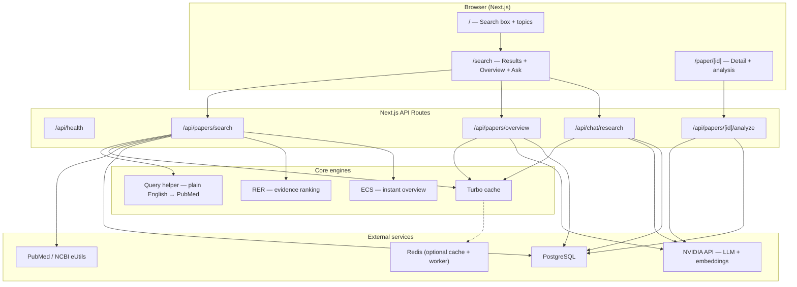
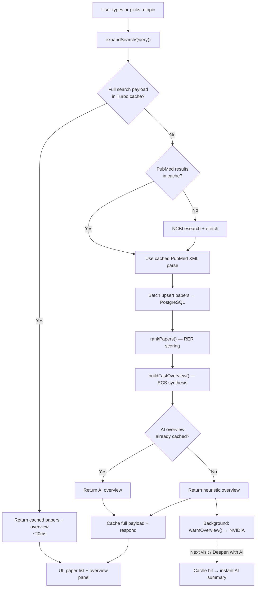
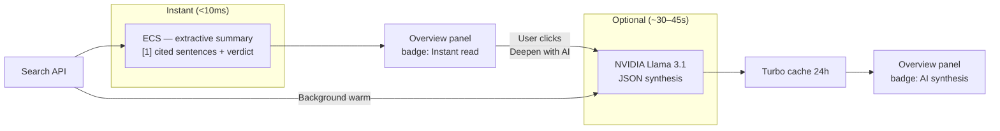
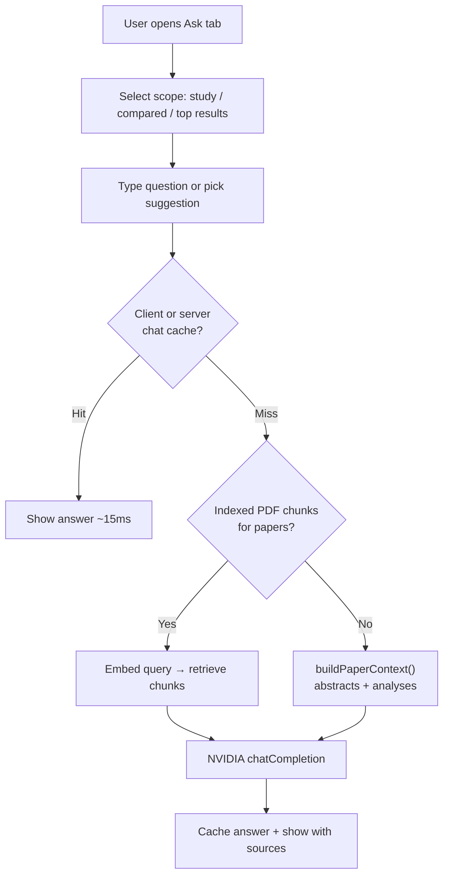
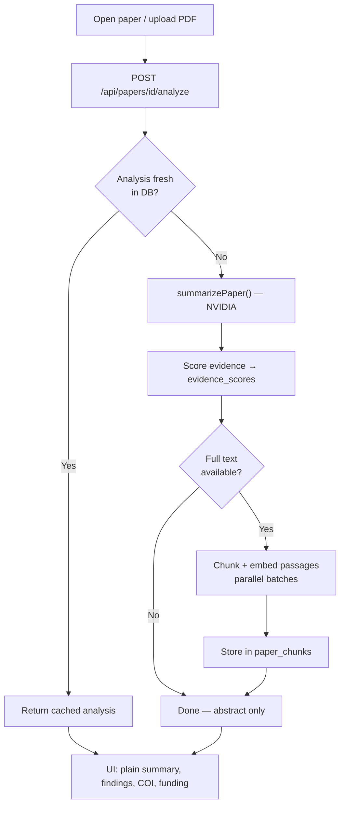

# Synapse

**Health questions, answered from real studies.**

Synapse is a biomedical research intelligence app: search PubMed in plain English, get an **instant evidence-ranked overview** in under a second, then optionally deepen with NVIDIA AI or ask follow-up questions across papers.

**Live repo:** [github.com/Konseptt/synapse-research](https://github.com/Konseptt/synapse-research)

---

## What makes it fast

| Layer | What it does | Typical latency |
|-------|----------------|-----------------|
| **Turbo cache** | In-memory + Redis cache for PubMed, full search payloads, AI overviews, chat | Repeat queries: **~20ms** |
| **RER** (Research Evidence Rank) | Ranks papers by study design, sample, recency, rigor — no API | **&lt;1ms** per result set |
| **ECS** (Extractive Consensus Synthesis) | Cited overview from abstract lead sentences + effect signals | **&lt;5ms** |
| **NVIDIA AI** (optional) | Deeper synthesis & chat; warmed in background after search | **~30–45s** cold; cached after |

Users never wait on AI to see useful results. AI is opt-in (“Deepen with AI”) or served from cache after background warming.

---

## Architecture



---

## Search flow

From question to ranked papers + instant overview in one request.



---

## Overview synthesis flow

Three tiers of depth; only the last uses a slow LLM call.



**Verdict sources**

- **ECS:** RER-weighted vote across effect-direction signals in abstracts
- **AI:** Model-generated `verdict` + `uncertainty` with `[n]` citations

---

## Ask / follow-up flow



---

## Paper analysis flow (upload or PubMed detail)



---

## Prerequisites

- **Node.js 20+**
- **PostgreSQL** (local Homebrew, Docker, or Neon)
- **NVIDIA API key** (for AI deepen, chat, analysis)
- **Docker** (optional — `docker compose` for Postgres + Redis)
- **NCBI email** (required for PubMed in production)

---

## Quick start

```bash
# 1. Optional: Postgres + Redis via Docker (from repo root)
docker compose up -d

# 2. Environment
cp .env.example frontend/.env.local
# Edit frontend/.env.local:
#   DATABASE_URL, NVIDIA_API_KEY, NCBI_EMAIL

# 3. Install & migrate
cd frontend
npm install
npm run db:push

# 4. Dev server
npm run dev
```

Open **[http://localhost:3001](http://localhost:3001)** (dev runs on port **3001**).

Optional background worker (PDF queue via BullMQ):

```bash
# In frontend/, with USE_WORKER=true and REDIS_URL set
npm run worker
```

---

## Environment variables

Copy `.env.example` → `frontend/.env.local`.

| Variable | Required | Description |
|----------|----------|-------------|
| `DATABASE_URL` | Yes | PostgreSQL connection string |
| `NVIDIA_API_KEY` | For AI | NVIDIA Integrate API key |
| `NVIDIA_MODEL` | No | Default `meta/llama-3.1-8b-instruct` |
| `NCBI_EMAIL` | Prod | Your email for NCBI eUtils |
| `NCBI_TOOL` | No | App name sent to PubMed |
| `REDIS_URL` | Optional | Shared Turbo cache + BullMQ worker |
| `AUTH_ENABLED` | No | `false` for public local dev |

---

## Stack

| Layer | Technology |
|-------|------------|
| Framework | Next.js 16 App Router (Turbopack) |
| UI | Tailwind, shadcn/ui, TanStack Query, Zustand |
| Database | Drizzle ORM + PostgreSQL |
| AI | NVIDIA API (OpenAI-compatible) — Llama 3.1 + embedqa |
| Search | PubMed eUtils, custom query expansion |
| Jobs | BullMQ + Redis (optional PDF worker) |
| Graph | React Flow (`/graph`) |

---

## API routes

| Method | Route | Description |
|--------|-------|-------------|
| GET | `/api/health` | DB + AI config check |
| GET | `/api/papers/search` | PubMed search, RER rank, ECS overview, cache |
| POST | `/api/papers/overview` | AI overview (`?force=true` to bypass cache) |
| GET | `/api/papers/[id]` | Paper detail + analysis |
| POST | `/api/papers/[id]/analyze` | Trigger NVIDIA paper analysis |
| GET | `/api/papers/[id]/evidence` | Evidence score breakdown |
| GET | `/api/papers/compare` | Side-by-side paper comparison |
| POST | `/api/papers/conflicts` | Contradiction detection across papers |
| POST | `/api/chat/research` | Multi-paper RAG Q&A |
| POST | `/api/papers/upload` | PDF upload |
| GET | `/api/graph/topic/[topic]` | Topic knowledge graph |

---

## Project layout

```
.
├── frontend/                 # Next.js app (deploy root on Vercel)
│   ├── src/
│   │   ├── app/              # Pages + API routes
│   │   ├── features/         # Search, papers, evidence, graph UI
│   │   ├── lib/
│   │   │   ├── cache/        # Turbo cache (memory + Redis)
│   │   │   ├── search/       # Query helper, RER, ECS/heuristic overview
│   │   │   ├── services/     # PubMed, RAG, sync, scoring
│   │   │   └── ai/           # NVIDIA provider + chains
│   │   └── types/
│   └── scripts/
│       ├── smoke-test.ts     # E2E API smoke test
│       └── worker.ts         # BullMQ PDF worker
├── docker-compose.yml
└── .env.example
```

---

## Testing

```bash
cd frontend

# Unit tests (27+)
npm test

# E2E against running dev server
npm run dev          # terminal 1
npm run test:smoke   # terminal 2 — search, overview, chat + cache timing

# Production build
npm run build
```

---

## Deploy to Vercel

1. Import [github.com/Konseptt/synapse-research](https://github.com/Konseptt/synapse-research) on [vercel.com/new](https://vercel.com/new)
2. Set **Root Directory** = `frontend`
3. Add **Neon Postgres** (or any Postgres) → `DATABASE_URL`
4. Set `NVIDIA_API_KEY`, `NCBI_EMAIL`, and other vars from `.env.example`
5. Deploy — `vercel-build` runs `drizzle-kit push` then `next build`

For Redis-backed shared cache in production, add Upstash Redis and set `REDIS_URL`.

---

## Disclaimer

Synapse synthesizes published research for informational purposes. It is **not** medical advice. Always consult a qualified professional for health decisions.
